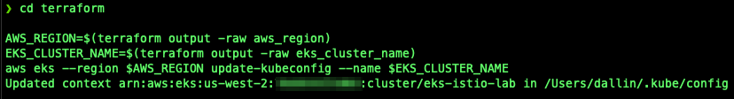

# Using Istio to Secure Workloads with Amazon Elastic Kubernetes Service (EKS)


## Table of Contents

1. [Introduction](#introduction)
2. [What is a Service Mesh?](#what-is-a-service-mesh)
3. [What is Istio?](#what-is-istio)
4. [Architecture Overview](#architecture-overview)
5. [Prerequisites](#prerequisites)
6. [Setup and Deploy Infrastructure](#setup-and-deploy-infrastructure)
7. [Configure access to Amazon EKS Cluster](#configure-access-to-amazon-eks-cluster)
8. [Configure and Install Flux](#configure-and-install-flux)
9. [Managing Flux](#managing-flux)
10. [Kubernetes Addons managed by Flux](#kubernetes-addons-managed-by-flux)
11. [Istio and Istio Addons managed by Flux](#istio-and-istio-addons-managed-by-flux)
12. [Applications managed by Flux](#applications-managed-by-flux)
13. [Access Applications managed by Flux](#access-applications-managed-by-flux)
14. [Demonstrate how Flux works](#demonstrate-how-flux-works)
    1. [Check the Status of Flux](#check-the-status-of-flux)
    2. [Reconcile Helm Release with Flux](#reconcile-helm-release-with-flux)
15. [Clean Up](#clean-up)
    1. [Clean up Applications managed by Flux from Kubernetes](#clean-up-applications-managed-by-flux-from-kubernetes)
    2. [Clean up Kubernetes AddOns managed by Flux from Kubernetes](#clean-up-kubernetes-addons-managed-by-flux-from-kubernetes)
    3. [Uninstall Flux from Kubernetes](#uninstall-flux-from-kubernetes)
    4. [Clean up Terraform](#clean-up-terraform)
16. [Conclusion](#conclusion)

## Introduction

Have you ever wondered if there was a better way to manage the lifecycle of an application, from deploying the application, scaling the application, and managing the required infrastructure while storing the code in Git and allowing versioning of the code? Well, there is a way. It is called GitOps.

This guide will explain what GitOps is and show you how to use Flux, a GitOps tool, with Amazon Elastic Kubernetes Service (EKS). You will use Flux to deploy various Kubernetes Services and Applications to Amazon Elastic Kubernetes Service (EKS). In addition, you will create a container image containing the code for the React container. You will upload the container image to a private Amazon Elastic Container Registry.

You can access all of the code used in my [GitHub Repository](https://github.com/junglekid/aws-eks-istio-lab).

Before we begin, let's define what GitOps is and what GitOps tool we will use in this guide.

## What is a Service Mesh?

ChatGPT-4
A service mesh is an infrastructure layer for handling service-to-service communication in microservices architectures. As the name suggests, it's a mesh of interconnected services, and it's primarily designed to solve problems and provide functionalities that become evident when you have many services talking to each other, especially in cloud-native deployments like Kubernetes.

Here's a breakdown of what a service mesh provides:

1. **Traffic Management:** Control the flow of traffic and API calls between services. This can be useful for features like canary deployments, A/B testing, and blue-green deployments.

2. **Load Balancing:** Distribute incoming requests to different instances of a service, taking into account the service's health, availability, and other metrics.

3. **Service Discovery:** Automatically discover and connect to available service instances in dynamic environments.

4. **Security:** Secure communication between services with features like mutual TLS authentication, identity verification, and authorization.

5. **Observability:** Provide insights into the behavior of your services through metrics, logging, and tracing. This allows for monitoring, anomaly detection, and troubleshooting.

6. **Fault Tolerance:** Implement strategies to handle service failures, such as timeouts, retries, circuit breakers, and rate limiting.

7. **Policy Enforcement:** Set and enforce policies related to security, traffic, and other aspects without changing the service code.

A service mesh achieves these functionalities using two main components:

1. **Data Plane:** This is where the actual processing of the traffic occurs. It typically consists of lightweight proxies (e.g., Envoy in the case of Istio) that are deployed alongside each service instance, often referred to as "sidecars". These proxies intercept and handle all the network traffic for their associated service.

2. **Control Plane:** This is the brain behind the service mesh, responsible for managing and configuring the sidecar proxies. It provides interfaces for operators to set desired traffic rules, policies, and more.

The concept of a service mesh has gained popularity with the rise of container orchestration platforms like Kubernetes. When you have dozens, hundreds, or even thousands of services communicating, the complexity can become overwhelming. A service mesh abstracts and manages this complexity, allowing developers and operators to focus more on business logic and less on network-related challenges.

Popular service mesh implementations include Istio, Linkerd, and Consul Connect, among others.

Bard

A service mesh is a dedicated infrastructure layer that controls service-to-service communication in a microservices architecture. It handles tasks such as load balancing, service discovery, authentication, authorization, and fault tolerance. A service mesh is typically implemented using a sidecar proxy that runs alongside each microservice.

Service meshes are becoming increasingly popular as microservices architectures become more widely adopted. Microservices architectures offer a number of benefits, such as scalability, agility, and resilience. However, they also add complexity to managing and operating applications. A service mesh can help to simplify the management of microservices by providing a centralized layer for controlling service-to-service communication.

Here are some of the benefits of using a service mesh:

* **Improved performance**: A service mesh can improve the performance of microservices applications by optimizing traffic routing and load balancing.

* **Increased security**: A service mesh can help to protect microservices applications from attack by providing authentication, authorization, and encryption capabilities.

* **Enhanced observability**: A service mesh can collect and analyze telemetry data from all services in the mesh, providing a unified view of the application's health and performance.

* **Simplified management**: A service mesh can simplify the management of microservices applications by providing a centralized layer for controlling service-to-service communication.

Some popular service mesh implementations include Istio, Linkerd, and Consul Connect.

Here is a simple example of how a service mesh works:

1. A client application sends a request to a microservice.
2. The request is intercepted by the service mesh proxy running alongside the microservice.
3. The service mesh proxy authenticates the client application and authorizes it to access the microservice.
4. The service mesh proxy routes the request to the microservice instance that is best suited to handle it.
5. The microservice instance processes the request and sends a response back to the client application.
6. The service mesh proxy decrypts the response and sends it to the client application.

The service mesh proxy is transparent to the client application and the microservice instance. The client application does not need to know anything about the service mesh in order to communicate with the microservice.

Service meshes can be a valuable tool for managing microservices applications. They can help to improve performance, security, observability, and manageability.

## What is Istio?

Chat-GPT 4

Istio is an open-source service mesh that provides a way to control, connect, secure, and monitor microservices, typically in Kubernetes environments. With the microservices architecture gaining popularity, challenges related to inter-service communication, monitoring, and security became evident. Istio aims to address these challenges.

Here are some of the key features and capabilities provided by Istio:

1. **Traffic Management:** Istio provides advanced routing and traffic management capabilities. This includes A/B testing, canary releases, traffic splitting, and fault injection.

2. **Observability:** With Istio, you can gain insights into how services are interacting with each other. It provides detailed metrics, logs, and distributed traces that help in understanding the performance and behavior of applications.

3. **Security:** Istio provides a robust security model that includes service-to-service authentication, authorization, and encryption. With Istio, you can enforce policies at runtime and ensure secure communication between services.

4. **Resilience:** Istio provides features like timeouts, retries, circuit breakers, and pool ejection which help in making your applications more resilient to failures.

5. **Policy Enforcement:** Istio allows you to configure and enforce policies at runtime without changing the application code. This can be particularly useful for rate limiting, access controls, and quota management.

6. **Extensibility:** Istio's architecture allows it to be easily extended to integrate with other systems and tools.

To achieve these features, Istio uses a sidecar proxy (usually Envoy) that is deployed alongside each microservice. This sidecar intercepts all the network traffic for that microservice and provides the aforementioned capabilities. This design enables Istio to be platform-agnostic, meaning it can be used with any combination of workloads and orchestrators.

Istio's control plane components, including the likes of Pilot, Mixer, Citadel, and Galley, provide the necessary configuration to the sidecar proxies to handle the traffic according to user-defined policies.

For developers and operators working in Kubernetes and other cloud-native environments, Istio offers a powerful toolkit to help manage the complexities of distributed systems.

Bard

Istio is an open-source service mesh that provides a uniform way to connect, secure, control, and observe services. It layers transparently onto existing distributed applications without requiring any changes to application code.

Istio is made up of two main components: the data plane and the control plane. The data plane is responsible for handling and routing traffic between services. It does this by deploying a sidecar proxy alongside each service. The sidecar proxy intercepts all incoming and outgoing traffic to and from the service and applies Istio's policies to it.

The control plane is responsible for configuring and managing the data plane. It provides a unified view of all services in the mesh and allows administrators to define and enforce policies for those services.

Istio provides a number of features that can be used to manage microservices, including:

* **Traffic management**: Istio provides fine-grained control over traffic routing, load balancing, and retries. This can be used to improve the performance and reliability of microservices applications.

* **Security**: Istio provides mutual TLS authentication and authorization for services. It can also be used to encrypt traffic between services and to implement other security features such as rate limiting and circuit breaking.

* **Observability**: Istio collects and aggregates telemetry data from all services in the mesh. This data can be used to monitor the health and performance of microservices applications.

Istio is a powerful tool that can be used to simplify the management of microservices applications. It is used by a number of large companies, including Google, Netflix, and IBM.

Here are some of the benefits of using Istio:

* **Reduced complexity**: Istio centralizes the management of microservices, making it easier to manage and operate complex applications.

* **Improved performance**: Istio can improve the performance of microservices applications by optimizing traffic routing and load balancing.

* **Increased security**: Istio provides a number of security features that can help to protect microservices applications from attack.

* **Enhanced observability**: Istio collects and aggregates telemetry data from all services in the mesh, providing a unified view of the application's health and performance.

Overall, Istio is a powerful tool that can help organizations to modernize their applications and improve their performance, security, and observability.

## Architecture Overview

* HashiCorp Terraform
* Istio
* Flux
* GitHub
* Amazon Elastic Kubernetes Service (EKS)
* Amazon Elastic Container Registry (ECR)
* AWS Key Management Service (KMS)
* Amazon Route 53
* AWS Certificate Manager (ACM)
* Amazon Virtual Private Cloud (Amazon VPC)
* IAM policies and roles

## Prerequisites

Before you begin, make sure you have the following before starting:

1. An active AWS account. You can create a new [AWS account here](https://repost.aws/knowledge-center/create-and-activate-aws-account).
2. AWS CLI installed and configured. Instructions can be found [here](https://aws.amazon.com/cli/).
3. Terraform installed. Instructions can be found [here](https://developer.hashicorp.com/terraform/tutorials/aws-get-started/install-cli).
4. Helm installed. Instructions can be found [here](https://helm.sh/docs/intro/install).
5. Kubernetes CLI (kubectl). Instructions can be found [here](https://kubernetes.io/docs/tasks/tools/#kubectl).
6. Flux CLI. Instructions can be found [here](https://fluxcd.io/flux/installation/#install-the-flux-cli).
7. A GitHub Personal Access Token. Instructions can be found [here](https://docs.github.com/en/authentication/keeping-your-account-and-data-secure/managing-your-personal-access-tokens#creating-a-personal-access-token-classic).

## Setup and Deploy Infrastructure

Follow these steps to set up the environment.

1. Set variables in "locals.tf". Below are some of the variables that should be set.

   * aws_region
   * aws_profile
   * tags
   * public_base_domain_name

2. Update Terraform S3 Backend in provider.tf

   * bucket
   * key
   * profile
   * dynamodb_table

3. Navigate to the Terraform directory

   ```bash
   cd terraform
   ```

4. Initialize Terraform

   ```bash
   terraform init
   ```

5. Validate the Terraform code

   ```bash
   terraform validate
   ```

6. Run, review, and save a Terraform plan

   ```bash
   terraform plan -out=plan.out
   ```

7. Apply the Terraform plan

   ```bash
   terraform apply plan.out
   ```

8. Review Terraform apply results

   

## Configure access to Amazon EKS Cluster

Amazon EKS Cluster details can be extracted from terraform output or by accessing the AWS Console to get the name of the cluster. This following command can be used to update the kubeconfig in your local machine where you run kubectl commands to interact with your EKS Cluster. Navigate to the root of the directory of the GitHub repo and run the following commands:

   ```bash
   cd terraform

   AWS_REGION=$(terraform output -raw aws_region)
   EKS_CLUSTER_NAME=$(terraform output -raw eks_cluster_name)
   aws eks --region $AWS_REGION update-kubeconfig --name $EKS_CLUSTER_NAME
   ```

Results of configuring kubeconfig.



## Install Istioctl CLI

1. Install Istioctl CLI

   a. For macOS or Linux, follow these instructions using [Homebrew](https://brew.sh/)

      ```bash
      brew install istioctl
      ```

   b. For Windows, follow these instructions.

      1. Install with Scoop

         ```powershell
         scoop bucket add main
         scoop install main/istioctl
         ```

      2. Install with Chocolatey

         ```
         choco install istioctl
         ```

   c. Install instructions for other methods can be found [here](https://istio.io/latest/docs/setup/getting-started/).

2. Instructions on how to use **istioctl** can be found[here](https://istio.io/latest/docs/reference/commands/istioctl) and [here]
(<https://istio.io/latest/docs/ops/diagnostic-tools/istioctl>).

## Configure and Install Flux

1. Configure Variables needed to install Flux

   ```bash
   export GITHUB_TOKEN='<REPLACE_WITH_GITHHUB_TOKEN>'
   export GITHUB_USER='<REPLACE_WITH_GITHUB_USER>'
   export GITHUB_OWNER='<REPLACE_WITH_GITHUB_OWNER>'
   export GITHUB_REPO_NAME='<REPLACE_WITH_GITHUB_REPO_NAME>'
   ```

2. Configure Flux Repository by running the "configure.sh" script. The "configure.sh" script updates the various applications with the necessary values to run correctly. Navigate to the root of the directory of the GitHub repo and run the following commands:

   ```bash
   cd scripts

   ./configure.sh
   cd ..
   ```

3. Results of running the "configure.sh" script.

   

4. Install Flux on the Amazon EKS Cluster

   ```bash
   flux bootstrap github \
     --components-extra=image-reflector-controller,image-automation-controller \
     --owner=$GITHUB_OWNER \
     --repository=$GITHUB_REPO_NAME \
     --private=false \
     --path=clusters/eks-istio-lab \
     --personal
   ```

5. Results of installing Flux on the Amazon EKS Cluster.

   

## Managing Flux

Managing Flux is handled by using the Flux CLI. Flux does not come with any Web or UI interface to manage Flux. Please click [here](https://fluxcd.io/flux/cmd/) if you would like more information on the Flux CLI.

The following are some commands you can use to manage Flux.

```bash
flux get all
flux get sources all|git|helm|chart
flux get helmreleases
flux get kustomizations
flux logs
flux suspend kustomization <kustomization_name>
flux reconcile source git flux-system
```

In the section [Configure and Install Flux](#configure-and-install-flux), we configured and installed Flux. Once Flux was up and running, Flux began to reconcile the Git repository we specified, which installed and configured all of the defined Kubernetes Addons and Applications.

## Kubernetes Addons managed by Flux

Before the Applications that Flux manages, the Kubernetes Addons will be deployed and configured by Flux first. The following Kubernetes Addons will be installed.

* AWS Application Load Balancer Controller
* External DNS
* Cluster Autoscaler
* Cert manager
* Metrics Server

The AWS Application Load Balancer Controller and External DNS must be deployed first because the Applications need to be accessible by a load balancer and have the DNS Name registered with Route 53.

## Istio and Istio Addons managed by Flux

* [Istio](https://istio.io/) -
  * [Istiod](https://istio.io/latest/docs/ops/deployment/architecture/#istiod) - Provides service discovery, configuration, and certificate management
  * [Istio Ingress Gateway](https://istio.io/latest/docs/setup/additional-setup/gateway/)
* [Kiali](https://kiali.io/) - Console for Istio Service Mesh
* [Kube Prometheus Stack](https://github.com/prometheus-community/helm-charts/tree/main/charts/kube-prometheus-stack)
  * [Prometheus](https://prometheus.io/)
  * [Grafana](https://grafana.com/oss/)
* [Grafana Loki](https://grafana.com/oss/loki/)

## Applications managed by Flux

Flux can manage applications in several ways, but the most common way is through the Helm Controller. Flux will manage three Applications using Helm charts to deploy to the Amazon EKS Cluster. The three Applications are the following.

* [Bookinfo](https://istio.io/latest/docs/examples/bookinfo/) - Application used to demostrate various Istio features.
* [Podinfo](https://github.com/stefanprodan/podinfo) - A tiny web application made with Go

## Access Applications managed by Flux

Let's access the Applications managed by Flux. Retrieve the ***public_base_domain_name*** specified in the "locals.tf" when you ran Terraform earlier.

For the Bookinfo App, you can access the Bookinfo URL "bookinfo.<public_base_domain_name>" in your favorite web browser.


For the Podinfo App, you can access the Podinfo URL "podinfo.<public_base_domain_name>" in your favorite web browser.


The default user name and password for Weave GitOps are the following

* Username: admin
* Password: Flux&Git0ps

## Demonstrate how Flux works

To demonstrate how Flux works, we will be using the Flux CLI.

## Check the Status of Flux

Let's check the status of all resources managed by Flux by running the following command.

```bash
flux get all -A
```

Result of running the above command.


## Reconcile Helm Release with Flux

## Clean Up

## Clean up Applications managed by Flux from Kubernetes

1. Suspend Applications managed by Flux

   ```bash
   flux suspend source git flux-system
   flux suspend kustomization apps flux-system \
     monitoring-controllers monitoring-configs
   ```

2. Delete Applications managed by Flux

   ```bash
   flux delete helmrelease -s podinfo
   flux delete helmrelease -s -n monitoring loki-stack
   flux delete helmrelease -s -n monitoring kube-prometheus-stack
   kubectl delete -f ./k8s/apps/base/bookinfo/release.yaml
   kubectl delete -f ./k8s/apps/base/bookinfo/config.yaml
   kubectl delete -f ./k8s/apps/base/bookinfo/cert_request.yaml
   kubectl delete -f ./k8s/apps/base/podinfo/config.yaml
   kubectl delete -f ./k8s/apps/base/podinfo/cert_request.yaml
   ```

3. Wait 1 to 5 minutes for Applications to be removed from Kubernetes

4. Delete Application sources managed by Flux

   ```bash
   flux delete source helm -s podinfo
   flux delete source helm -s -n monitoring grafana-charts
   flux delete source helm -s -n monitoring prometheus-community
   ```

5. Verify Applications are removed

   ```bash
   kubectl -n bookinfo get all
   kubectl -n istio-ingress get ingresses bookinfo-ingress
   kubectl -n podinfo get all
   kubectl -n istio-ingress get ingresses podinfo-ingress
   kubectl -n monitoring get all
   ```

## Clean up Kubernetes Addons managed by Flux from Kubernetes

1. Suspend and Delete Kubernetes Addons managed by Flux

   ```bash
   flux suspend kustomization infra-apps infra-configs infra-controllers
   flux suspend helmrelease aws-load-balancer-controller
   flux suspend helmrelease cert-manager
   flux suspend helmrelease cluster-autoscaler
   flux suspend helmrelease external-dns
   flux suspend helmrelease kiali
   flux suspend helmrelease jaeger-operator
   flux suspend helmrelease istio-base
   flux suspend helmrelease istiod
   flux suspend helmrelease istio-ingressgateway
   kubectl patch kiali kiali -n istio-system -p '{"metadata":{"finalizers": []}}' --type=merge
   kubectl delete kiali --all --all-namespaces
   kubectl delete jaegers.jaegertracing.io -n observability jaeger
   flux delete helmrelease -s aws-load-balancer-controller
   flux delete helmrelease -s cert-manager
   flux delete helmrelease -s cluster-autoscaler
   flux delete helmrelease -s external-dns
   flux delete helmrelease -s kiali
   flux delete helmrelease -s jaeger-operator
   flux delete helmrelease -s istio-base
   flux delete helmrelease -s istiod
   flux delete helmrelease -s istio-ingressgateway
   kubectl delete -f ./k8s/infrastructure/apps/kiali/config.yaml --force=true --grace-period=0
   kubectl delete -f ./k8s/infrastructure/apps/kiali/cert_request.yaml
   kubectl delete crd kialis.kiali.io
   kubectl delete -n observability deployment jaeger-operator
   kubectl delete -n observability service jaeger-operator-metrics
   kubectl delete -n observability service jaeger-operator-webhook-service
   ```

2. Wait 1 to 5 minutes for Applications to be removed from Kubernetes

3. Delete Application sources managed by Flux

   ```bash
   flux delete source helm -s cert-manager
   flux delete source helm -s cluster-autoscaler
   flux delete source helm -s eks-charts
   flux delete source helm -s external-dns
   flux delete source helm -s istio
   flux delete source helm -s jaegertracing
   flux delete source helm -s jetstack
   flux delete source helm -s kiali
   flux delete source helm -s metrics-server
   ```

4. Verify Kubernetes Addons were removed successfully

   ```bash
   kubectl -n kube-system get all -l app.kubernetes.io/name=external-dns
   kubectl -n kube-system get all -l app.kubernetes.io/name=aws-load-balancer-controller
   kubectl -n kube-system get all -l app.kubernetes.io/name=aws-cluster-autoscaler
   kubectl -n cert-manager get all
   kubectl -n kiali-operator get all
   kubectl -n istio-ingress get ingresses kiali-ingress
   kubectl -n istio-ingress get all
   kubectl -n istio-system get all
   kubectl -n observability get all
   kubectl get ingressclasses -A
   ```

5. If any resources are not deleted, manually delete them.

## Uninstall Flux from Kubernetes

1. Uninstall Flux

   ```bash
   flux uninstall -s
   ```

2. Verify Flux was removed successfully

   ```bash
   kubectl get all -n flux-system
   ```

## Clean up Terraform

1. Navigate to the root of the directory of the GitHub repo and run the following commands

   ```bash
   cd terraform

   terraform destroy
   ```

2. Check Terraform destroy results

   

## Conclusion

In conclusion, this guide provided a comprehensive overview of utilizing Amazon EKS and Flux to implement the GitOps methodology for deploying and managing applications and infrastructure. GitOps, a DevOps approach, leverages version control and collaboration principles from Git to streamline application deployment and infrastructure management. Flux, an open-source tool, automates application deployments, infrastructure deployments, and lifecycle management in Kubernetes clusters.
