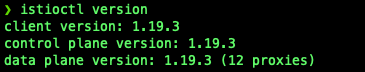
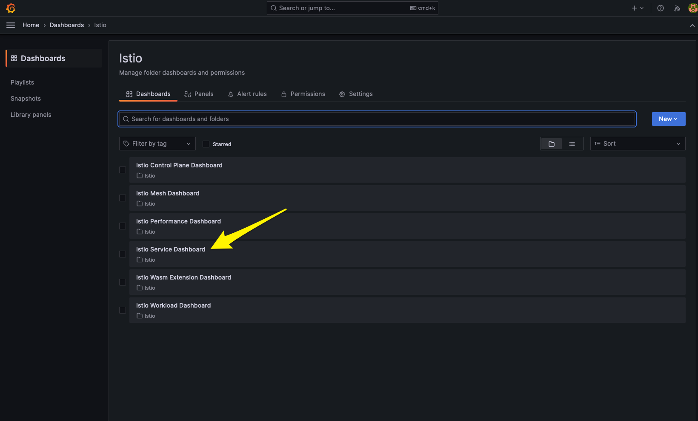

# Using Istio, a Service Mesh, with Amazon Elastic Kubernetes Service (EKS)


## Table of Contents

1. [Introduction](#introduction)
2. [What is a Service Mesh?](#what-is-a-service-mesh)
3. [What is Istio?](#what-is-istio)
4. [Architecture Overview](#architecture-overview)
5. [Prerequisites](#prerequisites)
6. [Setup and Deploy Infrastructure](#setup-and-deploy-infrastructure)
7. [Configure access to Amazon EKS Cluster](#configure-access-to-amazon-eks-cluster)
8. [Configure and Install Flux](#configure-and-install-flux)
9. [Managing Flux](#managing-flux)
10. [Kubernetes Addons managed by Flux](#kubernetes-addons-managed-by-flux)
11. [Applications managed by Flux](#applications-managed-by-flux)
12. [Istio and Istio Addons managed by Flux](#istio-and-istio-addons-managed-by-flux)
13. [Access Applications managed by Flux](#access-applications-managed-by-flux)
    1. [Access Bookinfo App](#access-bookinfo-app)
    2. [Access Podinfo App](#access-podinfo-app)
14. [Access Istio Addons](#access-istio-addons)
    1. [Access Kiali Dashboard](#access-kiali-dashboard)
    2. [Access Grafana Dashboard](#access-grafana-dashboard)
15. [Demonstrate how Istio works](#demonstrate-how-istio-works)
    1. [Populate Data for Kiali and Istio Dashboards in Grafana](#populate-data-for-kiali-and-istio-dashboards-in-grafana)
    2. [Access and Review Data in Kiali Dashboard](#access-and-review-data-in-kiali-dashboard)
    3. [Access Istio Dashboards in Grafana](#access-istio-dashboards-in-grafana)
16. [Clean Up](#clean-up)
    1. [Clean up Applications managed by Flux from Kubernetes](#clean-up-applications-managed-by-flux-from-kubernetes)
    2. [Clean up Kubernetes AddOns managed by Flux from Kubernetes](#clean-up-kubernetes-addons-managed-by-flux-from-kubernetes)
    3. [Uninstall Flux from Kubernetes](#uninstall-flux-from-kubernetes)
    4. [Clean up Terraform](#clean-up-terraform)
17. [Conclusion](#conclusion)

## Introduction

Have you ever wondered if there was a better way to manage, monitor, or secure your distributed microservices without adding these to your own code? Well, there is a way. It is called a Service Mesh.

This is the first part of the series on Using Istio, a Service Mesh, with Amazon Elastic Kubernetes Service (EKS). This guide will explain what Service Mesh and Istio are and show you how to use Istio, a Service Mesh, with Amazon Elastic Kubernetes Service (EKS). You will use Flux to deploy various Kubernetes Services and Applications, including Istio, and supporting applications and microservices to Amazon Elastic Kubernetes Service (EKS).

You can access the code in my [GitHub Repository](https://github.com/junglekid/aws-eks-istio-lab).

Before we begin, let's define what Service Mesh and Istio are.

## What is a Service Mesh?

A service mesh is a dedicated infrastructure layer for facilitating service-to-service communications between microservices, often in a cloud-based application. It's designed to handle a high volume of network-based inter-process communication among application infrastructure services using application programming interfaces (APIs).

Here's a breakdown of the key components and concepts of a service mesh:

1. **Sidecar Proxy**: In a typical service mesh, each microservice is paired with a lightweight network proxy that intercepts network communication. This proxy, often called a "sidecar," intercepts all network communication to and from the service.

2. **Data Plane**: The collection of sidecar proxies that intercept and control the network traffic between services make up the data plane. They are responsible for features like service discovery, health checking, routing, load balancing, authentication, authorization, and observability.

3. **Control Plane**: This is the administrative layer of the service mesh that provides the management capabilities. It allows operators to configure the proxies in the data plane and apply policies. It's also where the service mesh’s intelligence resides, as it controls the behavior of the proxy servers.

4. **Service Discovery**: Service meshes can dynamically recognize the addition of new services and the removal of old ones, adapting to the changes in the infrastructure.

5. **Traffic Management**: It can intelligently control the flow of traffic and API calls between services, handling load balancing, routing, and circuit breaking.

6. **Security**: Service meshes can handle encryption in transit and enforce security policies, like mutual TLS (mTLS), for service identity verification and secure communication.

7. **Observability**: Provides monitoring, logging, and tracing of service interactions, which is vital for diagnosing issues and understanding system behavior.

8. **Policy Enforcement**: It allows operators to apply organizational policies related to security, compliance, and governance across all service communications.

Examples of Service Meshes:

- **Istio**: One of the most popular service mesh solutions, Istio is designed to connect, secure, control, and observe services. It works with Kubernetes but can also be adapted to integrate with other environments. It provides robust traffic management, security features, and observability.

- **Linkerd**: Known for its simplicity and ease of use, Linkerd is a lightweight service mesh that offers core service mesh features like service discovery, routing, failure handling, and metrics. It's designed to be as transparent as possible and can be used with Kubernetes and other frameworks.

- **Consul**: Consul by HashiCorp provides a full-featured control plane with service discovery, health checking, and a service mesh. It can be used with Kubernetes or virtual machines and is known for its cross-datacenter functionality.

- **AWS App Mesh**: This service mesh provided by AWS makes it easy to manage and communicate between microservices across multiple types of compute infrastructure. App Mesh standardizes how your services communicate, giving end-to-end visibility and helping to ensure high availability for your applications.

Service meshes are helpful because they offload common functionalities from the application code, allowing developers to focus on the business logic rather than the complexities of networking. However, they also add a new layer to the infrastructure stack, which can increase complexity and the operational burden if not managed properly.

## What is Istio?

Istio is an open-source service mesh that helps organizations run distributed, microservices-based applications more securely, reliably, and efficiently. It's designed to connect, monitor, and secure microservices, providing tools to manage traffic flows between services, enforce policies, and aggregate telemetry data. Google, IBM, and Lyft originally developed it and are now part of the Cloud Native Computing Foundation (CNCF). Istio is platform-independent but often associated with Kubernetes, commonly used to orchestrate containers that host microservices.

Here's a brief overview of what Istio can do:

1. **Traffic Management**: Istio provides advanced routing capabilities, allowing for A/B testing, canary releases, and more. It does this by managing the flow of traffic and API calls between services, which is crucial in a microservices architecture. It enables request retries, fault injection, and traffic splitting for increased resilience and control.

2. **Security**: Istio enhances security by providing inter-service authentication and authorization without requiring changes to the application. It manages certificates and keys and ensures encrypted communication between services with mutual TLS (mTLS), helping to reduce the risk of man-in-the-middle attacks.

3. **Observability**: It offers insights into the behavior of the services, including monitoring, logging, and tracing of the communications, which helps in understanding the performance and issues in the applications.

4. **Policy Enforcement**: Istio allows you to enforce policies regarding access control and resource usage across your microservices without modifying the services themselves.

5. **Service Discovery**: Istio supports service discovery mechanisms, making it easier for services to find and communicate with each other in a dynamic environment.

Istio achieves these features by deploying a special sidecar proxy (Envoy proxy) alongside each service instance. These proxies intercept and control all network communication between microservices, and they are managed by Istio's control plane, which provides the necessary rules for the proxies.

Istio’s service mesh architecture is composed of:

- **Data Plane**: Consisting of intelligent proxies (Envoy) deployed as sidecars that mediate and control all network communication between microservices.

- **Control Plane**: Manages and configures the proxies to route traffic and enforces policies at runtime.

Istio is designed to work on various environments, including on-premises, cloud-hosted, and hybrid environments, and it can run with services written in any language.

Istio operates at the platform layer, providing the infrastructure necessary to manage the interactions between microservices, while the application code remains unaware of Istio’s existence. It is typically used in Kubernetes environments but can also be used with other orchestration solutions. Its control plane architecture is responsible for managing the overall configuration and behavior of the service mesh.

By decoupling development concerns from operational challenges, Istio provides a uniform way to secure, connect, and monitor microservices.

Now that we have discussed what Service Mesh and Istio are, we will discuss what technologies we will use and review the Terraform code used to configure and deploy the Infrastructure.

## Architecture Overview

- HashiCorp Terraform
- Istio
- Flux
- GitHub
- Amazon Elastic Kubernetes Service (EKS)
- Amazon Elastic Container Registry (ECR)
- AWS Key Management Service (KMS)
- Amazon Route 53
- AWS Certificate Manager (ACM)
- Amazon Virtual Private Cloud (Amazon VPC)
- IAM policies and roles

## Prerequisites

Before you begin, make sure you have the following before starting:

1. An active AWS account. You can create a new [AWS account here](https://repost.aws/knowledge-center/create-and-activate-aws-account).
2. AWS CLI installed and configured. Instructions can be found [here](https://aws.amazon.com/cli/).
3. Terraform installed. Instructions can be found [here](https://developer.hashicorp.com/terraform/tutorials/aws-get-started/install-cli).
4. Helm installed. Instructions can be found [here](https://helm.sh/docs/intro/install).
5. Kubernetes CLI (kubectl). Instructions can be found [here](https://kubernetes.io/docs/tasks/tools/#kubectl).
6. Flux CLI. Instructions can be found [here](https://fluxcd.io/flux/installation/#install-the-flux-cli).
7. A GitHub Personal Access Token. Instructions can be found [here](https://docs.github.com/en/authentication/keeping-your-account-and-data-secure/managing-your-personal-access-tokens#creating-a-personal-access-token-classic).

## Setup and Deploy Infrastructure

Follow these steps to set up the environment.

1. Set variables in "locals.tf". Below are some of the variables that should be set.

   - aws_region
   - aws_profile
   - tags
   - public_base_domain_name

2. Update Terraform S3 Backend in provider.tf

   - bucket
   - key
   - profile
   - dynamodb_table

3. Navigate to the Terraform directory

   ```bash
   cd terraform
   ```

4. Initialize Terraform

   ```bash
   terraform init
   ```

5. Validate the Terraform code

   ```bash
   terraform validate
   ```

6. Run, review, and save a Terraform plan

   ```bash
   terraform plan -out=plan.out
   ```

7. Apply the Terraform plan

   ```bash
   terraform apply plan.out
   ```

8. Review Terraform apply results

   

## Configure access to Amazon EKS Cluster

Amazon EKS Cluster details can be extracted from terraform output or by accessing the AWS Console to get the name of the cluster. This following command can be used to update the kubeconfig in your local machine where you run kubectl commands to interact with your EKS Cluster. Navigate to the root of the directory of the GitHub repo and run the following commands:

   ```bash
   cd terraform

   AWS_REGION=$(terraform output -raw aws_region)
   EKS_CLUSTER_NAME=$(terraform output -raw eks_cluster_name)
   aws eks --region $AWS_REGION update-kubeconfig --name $EKS_CLUSTER_NAME
   ```

Results of configuring kubeconfig.


## Install Istio CLI - istioctl

1. Install Istioctl CLI

   a. For macOS or Linux, follow these instructions using [Homebrew](https://brew.sh/)

      ```bash
      brew install istioctl
      ```

   b. For Windows, follow these instructions.

      1. Install with [Chocolatey](https://chocolatey.org/install)

         ```powershell
         choco install istioctl
         ```

      2. Install with [Scoop](https://scoop.sh/)

         ```powershell
         scoop bucket add main
         scoop install main/istioctl
         ```

   c. Install instructions for other methods can be found [here](https://istio.io/latest/docs/setup/getting-started/).

2. Instructions on how to use **istioctl** can be found [here](https://istio.io/latest/docs/reference/commands/istioctl) and [here](https://istio.io/latest/docs/ops/diagnostic-tools/istioctl).

3. Verify that **istioctl** is installed by running the following command.

   ```bash
   istioctl version
   ```

4. Results of running **istioctl**.

   

## Configure and Install Flux

1. Configure Variables needed to install Flux

   ```bash
   export GITHUB_TOKEN='<REPLACE_WITH_GITHHUB_TOKEN>'
   export GITHUB_USER='<REPLACE_WITH_GITHUB_USER>'
   export GITHUB_OWNER='<REPLACE_WITH_GITHUB_OWNER>'
   export GITHUB_REPO_NAME='<REPLACE_WITH_GITHUB_REPO_NAME>'
   ```

2. Configure the Flux Repository by running the "configure.sh" script. The "configure.sh" script updates the various applications with the necessary values to run correctly. Navigate to the root of the directory of the GitHub repo and run the following commands:

   ```bash
   cd scripts

   ./configure.sh
   cd ..
   ```

3. Results of running the "configure.sh" script.

   

4. Install Flux on the Amazon EKS Cluster

   ```bash
   flux bootstrap github \
     --components-extra=image-reflector-controller,image-automation-controller \
     --owner=$GITHUB_OWNER \
     --repository=$GITHUB_REPO_NAME \
     --private=false \
     --path=clusters/eks-istio-lab \
     --personal
   ```

5. Results of installing Flux on the Amazon EKS Cluster.

   

6. Wait 2 to 5 minutes for Flux to reconcile the Git repository we specified, During this time, Flux will install and configure all of the defined Kubernetes Addons and Applications.

7. Run the following command to check if all of the Kubernetes Addons and Applications deployed successfully

   ```bash
   flux get all -A
   ```

## Managing Flux

Managing Flux is handled by using the Flux CLI. Flux does not come with any Web or UI interface to manage Flux. Please click [here](https://fluxcd.io/flux/cmd/) if you would like more information on the Flux CLI.

The following are some commands you can use to manage Flux.

```bash
flux get all
flux get sources all|git|helm|chart
flux get helmreleases
flux get kustomizations
flux logs
flux suspend kustomization <kustomization_name>
flux reconcile source git flux-system
```

For additional information on using Flux, please look at the following series I wrote about Flux.

- [Using Flux, a GitOps Tool, with Amazon Elastic Kubernetes Service (EKS) - Part 1](https://www.linkedin.com/pulse/using-flux-gitops-tool-amazon-elastic-kubernetes-service-rasmuson)
- [Using Flux, a GitOps Tool, with Amazon Elastic Kubernetes Service (EKS) - Part 2](https://www.linkedin.com/pulse/using-flux-gitops-tool-amazon-elastic-kubernetes-service-rasmuson-1c)
- [Using Flux, a GitOps Tool, with Amazon Elastic Kubernetes Service (EKS) - Part 3](https://www.linkedin.com/pulse/using-flux-gitops-tool-amazon-elastic-kubernetes-service-rasmuson-1f)

## Kubernetes Addons managed by Flux

Below are the Applications that Flux manages, the Kubernetes Addons will be deployed and configured by Flux first. The following Kubernetes Addons will be installed.

- AWS Application Load Balancer Controller
- External DNS
- Cluster Autoscaler
- Cert manager
- Metrics Server

The AWS Application Load Balancer Controller and External DNS must be deployed first because the Applications need to be accessible by a load balancer and have the DNS Name registered with Route 53.

## Applications managed by Flux

Flux manages the following applications. These applications will be used to demonstrate the various Istio features.

- [Bookinfo](https://istio.io/latest/docs/examples/bookinfo/) - A sample application composed of four separate microservices
- [Podinfo](https://github.com/stefanprodan/podinfo) - A tiny web application made with Go

## Istio and Istio Addons managed by Flux

Istio is comprised of the following three components.

- [Istio](https://istio.io/) - An open-source service mesh that provides a uniform way to connect, manage, and secure microservices, enabling traffic flow control, policy enforcement, and telemetry data aggregation without altering service code.
- [Istiod](https://istio.io/latest/docs/ops/deployment/architecture/#istiod) - Consolidated control plane daemon of the Istio service mesh, responsible for service discovery, configuration management, certificate issuance, and providing overall operational control.
- [Istio Ingress Gateway](https://istio.io/latest/docs/setup/additional-setup/gateway/) - A dedicated network gateway in the Istio service mesh architecture that manages incoming traffic routing to various services within the mesh.

The following components are not necessary to run Istio but are addons to help the observability features of Istio.

- [Kiali](https://kiali.io/) - An open-source observability platform tailored for service mesh deployments, providing insights into the performance and structure of microservices networks within Istio. Kiali will retrieve data from Prometheus, Grafana, and Jaeger if installed and configured correctly.
- [Jaeger](https://www.jaegertracing.io/) - Distributed Tracing platform - An open-source, end-to-end distributed tracing system that helps monitor and troubleshoot transactions in complex, microservice-based architectures.
- [Kube Prometheus Stack](https://github.com/prometheus-community/helm-charts/tree/main/charts/kube-prometheus-stack)
  - [Prometheus](https://prometheus.io/) - An open-source monitoring system with a dimensional data model, flexible query language, and powerful alerting functionality for storing and querying time-series data.
  - [Grafana](https://grafana.com/oss/) - An open-source analytics and monitoring platform designed for visualizing and exploring metrics from various databases and time-series data.
- [Grafana Loki](https://grafana.com/oss/loki/) - A horizontally scalable, multi-tenant log aggregation system inspired by Prometheus, designed for cost-effective storage and querying of logs at scale.

## Access Applications managed by Flux

Let's access the Applications managed by Flux. Retrieve the ***public_base_domain_name*** specified in the "locals.tf" when you ran Terraform earlier.

### Access Bookinfo App

For the Bookinfo App, you can access the Bookinfo URL "https://bookinfo.<public_base_domain_name>/productpage" in your favorite web browser.


### Access Podinfo App

For the Podinfo App, you can access the Podinfo URL "https://podinfo.<public_base_domain_name>" in your favorite web browser.


## Access Istio Addons

Let's access the Istio Addons before we demonstrate how Istio works. Retrieve the ***public_base_domain_name*** specified in the "locals.tf" when you ran Terraform earlier.

### Access Kiali Dashboard

To access the Kiali Dashboard, follow these steps.

1. Access the Kiali URL "https://kiali.<public_base_domain_name>" in your favorite web browser.

   

2. Generate and retrieve **token** by running the following command

   ```bash
   kubectl -n istio-system create token kiali-service-account
   ```

   

3. Copy and paste the generated token from above to the Kiali Login page.

   

4. Log into the Kiali Dashboard.

   

### Access Grafana Dashboard

To access the Grafana Dashboard, follow these steps.

1. Access the Kiali URL "https://grafana.<public_base_domain_name>" in your favorite web browser.

   

2. Log into Grafana with the following username and password.

   - Username: admin
   - Password: Grafana&Git0ps

   

## Demonstrate how Istio works

Now that we know how to access the Applications let's demonstrate how Istio works. We will send several requests to the Bookinfo and Podinfo applications by running curl commands from the terminals or shells. We will do this to simulate enough traffic for Istio and the Istio Addons to capture the network traffic so the dashboards in Kiali and Grafana can display correctly.

## Populate Data for Kiali and Istio Dashboards in Grafana

1. Retrieve the ***public_base_domain_name*** specified in the "locals.tf" when you ran Terraform earlier.

2. Open two separate terminals or shells.

   **NOTE**: Run these commands as often as you want to populate the data in Kiali and Grafana.

3. Run the following command in the first terminal or shell to send traffic to the Bookinfo application. Replace <public_base_domain_name> with the actual domain name.

   ```bash
   for i in {1..720}; do curl -s -o /dev/null "https://bookinfo.<public_base_domain_name>/productpage" ; done

   ```

4. In the second terminal or shell, run the following command to send traffic to the Podinfo application. Replace <public_base_domain_name> with the actual domain name.

   ```bash
   for i in {1..720}; do curl -s -o /dev/null "https://podinfo.<public_base_domain_name>" ; done
   ```

It will take 4 to 5 minutes for the above commands to finish.

## Access and Review Data in Kiali Dashboard

While the commands above run, re-access the Kiali Dashboard and review the data.

1. Let's change the time range to the last 10 minutes by clicking in the upper right corner of the web page. Click on "Last 1m" to "Last 10m"..

   

2. Click on "Graph" on the left side of the Kiali Dashboard.

   

3. Click on "Select Namespaces" and choose "bookinfo".

   

   

4. Click anywhere on the Kiali Dashboard, and you should see something similar.

   

5. Click on "Display" and select "Response Time" and "Security".

   

6. Click anywhere on the Kiali Dashboard again, and you should see the response times and a little green lock on each connection.

   

7. Click on "productpage v1" on the Kiali Graph Dashboard, and you should see something like this. It will display information on the right-hand side of the Dashboard, such as Traffic and Traces.

   

8. Let's add the podinfo namespace to the Kiali Graph Dashboard. Click Namespace again and then podinfo. After selecting, you should see something like this.

   

9. Feel free to explore other parts of the Kiali Dashboard. The Kiali Dashboard pulls its data from Prometheus, Grafana, and Jaeger.

## Access Istio Dashboards in Grafana

Let's re-access the Grafana Dashboards for Istio and review the data. For details on what each Istio Dashboard does, click [here](https://istio.io/latest/docs/tasks/observability/metrics/using-istio-dashboard/).

**NOTE**: If the data is not showing in the Grafana Dashboards for Istio, re-run the commands from above to populate data for Bookinfo and Podinfo again.

1. Change to the Istio Dashboards in Grafana by clicking on Home in the upper left of the Grafana home page

   

2. Click on Dashboards

   

3. Hover over Istio and then click "Go to folder".

   

4. Istio Dashboards should now appear.

   

5. Click on Istio Mesh Dashboard In Grafana. This dashboard provides a global view of all services and applications used in the Service Mesh.

   

6. Let's navigate to the Istio Service Dashboard by clicking on Istio in the upper left-right next to "Home > Dashboards > Istio" and then click "Istio Service Dashboard".

   

   

   

7. Click on service on the Istio Service Dashboard and change to "productpage.bookinfo.svc.cluster.local" service and then expand General, Client Workloads, and Service Workloads sections.

   

8. Review the General, Client Workloads, and Service Workloads sections. In the Client Workloads and Service Workloads sections, you can see that mutual TLS (mTLS) is enabled and working correctly.

   

9. Feel free to explore other parts of the Istio Dashboards in Grafana.

## Clean Up

## Clean up Applications managed by Flux from Kubernetes

1. Suspend Applications managed by Flux

   ```bash
   flux suspend source git flux-system
   flux suspend kustomization apps flux-system \
     monitoring-controllers monitoring-configs
   ```

2. Delete Applications managed by Flux

   ```bash
   kubectl delete -f ./k8s/apps/base/bookinfo/config.yaml
   kubectl delete -f ./k8s/apps/base/bookinfo/cert_request.yaml
   kubectl delete -f ./k8s/apps/base/podinfo/config.yaml
   kubectl delete -f ./k8s/apps/base/podinfo/cert_request.yaml
   kubectl delete -f ./k8s/apps/base/bookinfo/release.yaml
   flux delete helmrelease -s podinfo
   flux delete helmrelease -s -n monitoring loki-stack
   flux delete helmrelease -s -n monitoring kube-prometheus-stack
   ```

3. Wait 1 to 5 minutes for Applications to be removed from Kubernetes

4. Delete Application sources managed by Flux

   ```bash
   flux delete source helm -s podinfo
   flux delete source helm -s -n monitoring grafana-charts
   flux delete source helm -s -n monitoring prometheus-community
   ```

5. Verify Applications are removed

   ```bash
   kubectl -n bookinfo get all
   kubectl -n istio-ingress get ingresses bookinfo-ingress
   kubectl -n podinfo get all
   kubectl -n istio-ingress get ingresses podinfo-ingress
   kubectl -n monitoring get all
   ```

## Clean up Infrastructure Applications managed by Flux from Kubernetes

1. Suspend Infrastructure Applications managed by Flux

   ```bash
   flux suspend kustomization infra-apps
   ```

2. Delete Infrastructure Applications managed by Flux

   ```bash
   kubectl delete -f ./k8s/infrastructure/apps/kiali/config.yaml --force=true --grace-period=0
   kubectl delete -f ./k8s/infrastructure/apps/kiali/cert_request.yaml
   kubectl patch kiali kiali -n istio-system -p '{"metadata":{"finalizers": []}}' --type=merge
   kubectl delete kiali --all --all-namespaces
   kubectl delete jaegers.jaegertracing.io -n observability jaeger
   flux delete helmrelease -s kiali
   flux delete helmrelease -s jaeger-operator
   kubectl delete crd kialis.kiali.io
   ```

3. Wait 1 to 5 minutes for Kubernetes Addons to be removed from Kubernetes

4. Delete Application sources managed by Flux

   ```bash
   flux delete source helm -s jaegertracing
   flux delete source helm -s kiali
   ```

5. Verify Kubernetes Addons were removed successfully

   ```bash
   kubectl -n kiali-operator get all
   kubectl -n observability get all
   kubectl -n istio-ingress get ingresses kiali-ingress
   ```

6. If any resources are not deleted, manually delete them.

## Clean up Kubernetes Addons managed by Flux from Kubernetes

1. Suspend Kubernetes Addons managed by Flux

   ```bash
   flux suspend kustomization infra-configs infra-controllers
   ```

2. Delete Kubernetes Addons managed by Flux

   ```bash
   flux delete helmrelease -s aws-load-balancer-controller
   flux delete helmrelease -s cert-manager
   flux delete helmrelease -s cluster-autoscaler
   flux delete helmrelease -s external-dns
   flux delete helmrelease -s istio-base
   flux delete helmrelease -s istiod
   flux delete helmrelease -s istio-ingressgateway
   flux delete helmrelease -s metrics-server
   ```

3. Wait 1 to 5 minutes for Kubernetes Addons to be removed from Kubernetes

4. Delete Application sources managed by Flux

   ```bash
   flux delete source helm -s cert-manager
   flux delete source helm -s cluster-autoscaler
   flux delete source helm -s eks-charts
   flux delete source helm -s external-dns
   flux delete source helm -s istio
   flux delete source helm -s jetstack
   flux delete source helm -s metrics-server
   ```

5. Verify Kubernetes Addons were removed successfully

   ```bash
   kubectl -n kube-system get all -l app.kubernetes.io/name=external-dns
   kubectl -n kube-system get all -l app.kubernetes.io/name=aws-load-balancer-controller
   kubectl -n kube-system get all -l app.kubernetes.io/name=aws-cluster-autoscaler
   kubectl -n cert-manager get all
   kubectl -n istio-ingress get ingresses kiali-ingress
   kubectl -n istio-ingress get all
   kubectl -n istio-system get all
   kubectl get ingressclasses -l app.kubernetes.io/name=aws-load-balancer-controller
   ```

6. If any resources are not deleted, manually delete them.

## Uninstall Flux from Kubernetes

1. Uninstall Flux

   ```bash
   flux uninstall -s
   ```

2. Verify Flux was removed successfully

   ```bash
   kubectl get all -n flux-system
   ```

## Clean up Terraform

1. Navigate to the root of the directory of the GitHub repo and run the following commands

   ```bash
   cd terraform

   terraform destroy
   ```

2. Check Terraform destroy results

   

## Conclusion

In conclusion, this guide provided a comprehensive overview of utilizing Istio, a service mesh, and Amazon EKS. A service mesh is an essential infrastructure component that enhances communication and operational capabilities within a microservices architecture. Istio, as a leading service mesh implementation, provides a robust set of features for traffic management, security, and observability without heavy lifting from developers. Istio works seamlessly with Amazon EKS, as EKS supports Kubernetes natively, and Istio is designed to work with Kubernetes-managed services. Users can leverage Istio within EKS to manage microservices traffic, enforce security policies, and observe communication patterns between services, all while taking advantage of the managed Kubernetes environment that EKS provides. This combination allows for a powerful, scalable, and secure system for managing microservices at scale.
